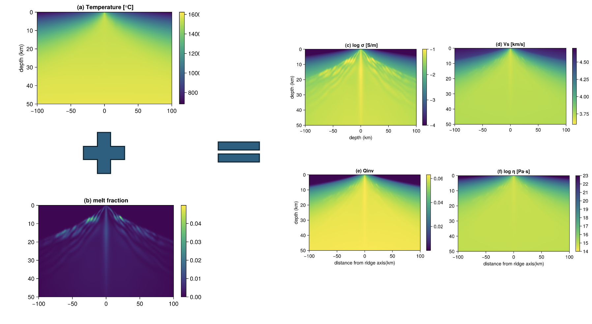
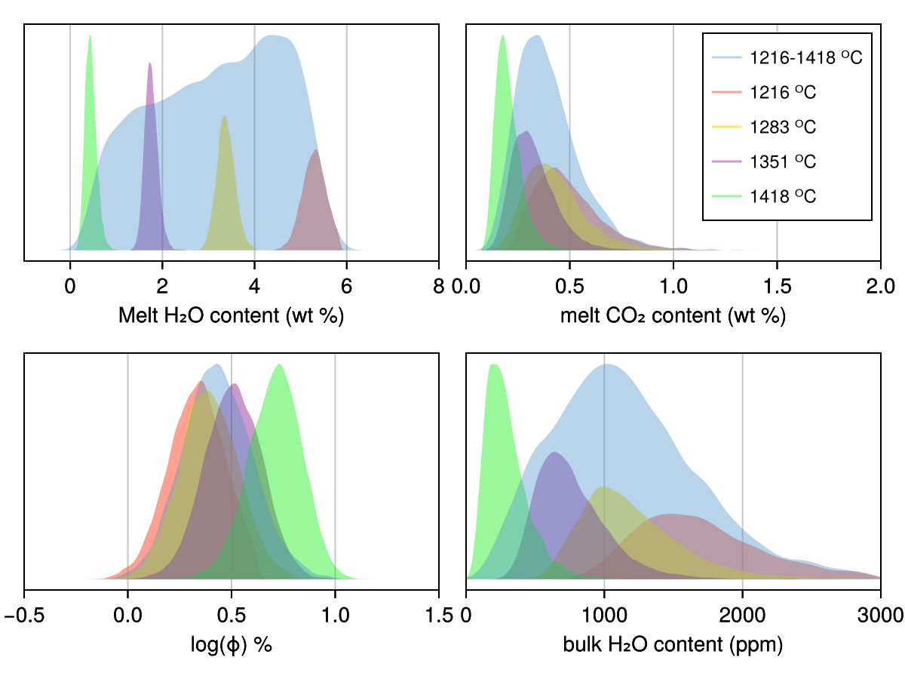

# Porosity.jl

## Rock physics modeling

`Porosity.jl` is a rock physics modeling and inference library written in julia, providing performant, AD compatible and scalable codes.

Check out the documentation [here](https://ayushinav.github.io/Porosity.jl/stable/)

`Porosity.jl` allows you to model geophysical observables from rock physics parameters., e.g., taking rock physics parameters from a model of mid-ocean ridge ([Sim et al., 2020
](https://www.sciencedirect.com/science/article/pii/S003192011930202X)) :

## Rock physics inference

The package also allows inference of rock physics parameters, while including different constraints (e.g. thermodynamics constraints). This allows you to obtain posteriors for these parameters (recreating Fig. 3 in [Blatter et al., 2022](https://www.nature.com/articles/s41586-022-04483-w)):

