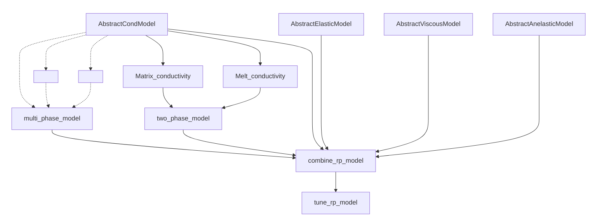

# Porosity.jl

`Porosity.jl` is a rock physics modeling and inference library written in julia, providing performant, AD compatible and scalable codes.

Available methods are : 

## Conductivity models

### olivine

* Jones2012
* Poe2010
* SEO3
* UHO2014
* Wang2006
* Yang2011
* Yoshino2009

### melt
* Gaillard2008
* Ni2011
* Sifre2014

### orthopyroxene

* Dai_Karato2009
* Zhang2012

## Elastic models

* anharmonic
* anhormonic_poro
* SLB2005

## Viscosity models

* HK2003
* HZK2011
* xfit_premelt

