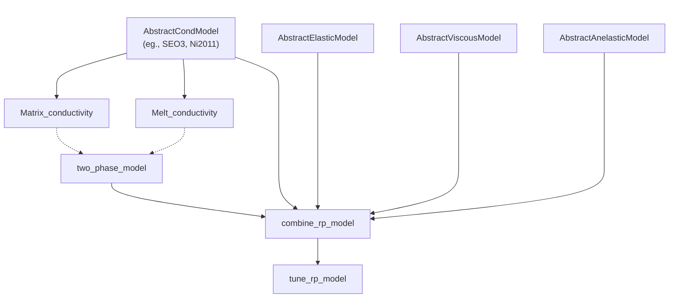

```@raw html
---
# https://vitepress.dev/reference/default-theme-home-page
layout: home

hero:
  name: Porosity.jl
  text: Rock physics parameter inference in Julia
  tagline: Automatic Differentiation enabled probabalistic inference of rock physics
  image:
    src: logo.png
    alt: Porosity.jl
  actions:
    - theme: alt
      text: View on Github
      link: https://github.com/ayushinav/Porosity.jl
    
features:
  - icon: 🔢
    title: Modeling
    details: Estimate geophysical observables using rock physics
    link: tutorials/getting_started

  - icon: 📊
    title: Probabilstic inference
    details: Perform probablistic inference of parameters
    link: /tutorials/stochastic_inverse

  - icon: ∂
    title: Differentiability
    details: Get derivatives using automatic differntiation
    link: /tutorials/ad
---
```

## Installation

`Porosity.jl` can be installed in julia as :

```julia
using Pkg
Pkg.add("Porosity.jl")
```

or if you are using REPL-mode : 

```repl
julia>
```

Enter the package mode by pressing `]`

```repl
pkg>
```

then

```repl
pkg> add Porosity
```


## Types and subtypes


