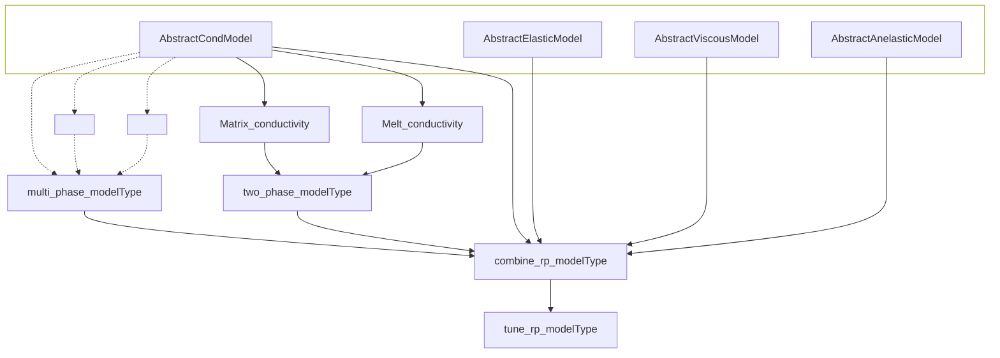

# Structure

One of the goals of this package is to provide an easy and intuitive way to compute the geophysical observables. In order to that, it is helpful to understand the structure of codes. The following serves as a cheatsheet to understand the structure.

The interface throughout the package proceeds in three steps:
1. Define the physics of the system
2. Define the rock physics model by providing the rock physics parameters
3. Call `forward`

::: code-group

```julia [Conductivity]
# define physics
model_type = SEO3

# define model
m = model_type(T)

# forward
resp = forward(m, [])
```

```julia [Elastic]
# define physics
model_type = anharmonic

# define model
m = model_type(T, P, ρ)

# forward
resp = forward(m, [])
```

```julia [Viscous]
# define physics
model_type = HK2003

# define model
m = model_type(T, P, dg, σ, ϕ)

# forward
resp = forward(m, [])
```

```julia [Anelastic]
# define physics
model_type = andrade_psp

# define model
m = model_type(T, P, dg, σ, ϕ, ρ, f)

# forward
resp = forward(m, [])
```

```julia [Phase mixing type]
# define physics
model_type = two_phase_modelType(Yoshino2009, Sifre2014, HS1962_plus)

# define model
ps_nt = (; T, Ch2o_ol, Ch2o_m, Cco2_m)
m = model_type(ps_nt)

# forward
resp = forward(m, [])
```

```julia [Combine models]
# define physics
model_type = multi_rp_modelType(SEO3, anharmonic, HK2003, andrade_psp)

# define model
ps_nt = (; T, Ch2o_ol, P, ρ, dg, σ, ϕ, f)
m = model_type(ps_nt)

# forward
resp = forward(m, [])
```

```julia [Tune models]
# define physics
fn_list = [solidus_Hirschmann2000, get_melt_fraction, get_Ch2o_m]
m_type = two_phase_modelType(Yoshino2009, Gaillard2008, HS1962_plus)
model_type = tune_rp_modelType(fn_list, m_type)

# define model
ps_nt = (; T, Ch2o, P)
m = model_type(ps_nt)

# forward
resp = forward(m, [])
```
:::

## Building blocks

Consider the example of [SEO3](@ref), a simple model that estimates the temperature dependent conductivity of olivine. It is a `AbstractCondModel`, which in simple terms groups all the models that estimate conductivity. Similarly, we have `AbstractElasticModel`, `AbstractViscousModel` and `AbstractAnelasticModel`. These are the main building blocks and are shown at the top in the following flowchart.



## Mixing phases
More often than not, we want to compute the bulk conductivity in the presence of fluids. This can be accompolished with [`two_phase_modelType`](@ref).
[Relevant tutorial](../tutorials/mixing_phases.md)

## Multi-rock physics
A further goal of the package is to encourage joint stochastic inference of more than one data types. For that purpose, we provide [`multi_rp_modelType`](@ref).
[Relevant tutorial](../tutorials/combine_models.md)

## Tuning rock physics
It happens in a lot of cases that one of the inputs to a rock physics model is dependent on the other, eg. melt fraction depends on temperature of the rock and its solidus temperature. In those cases where we want to tune one of the models with respect to others, [`tune_rp_modelType`](@ref) will come handy.
[Relevant tutorial](../tutorials/tune_rp.md)
