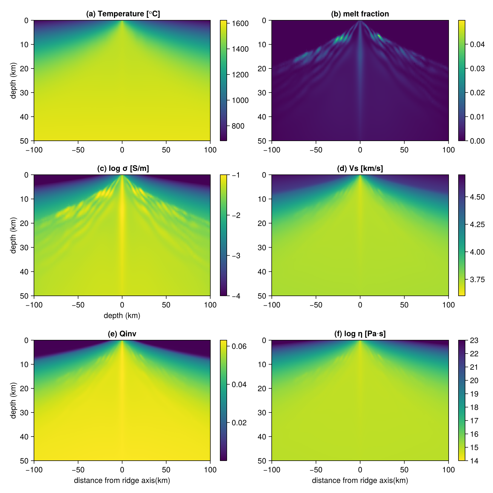

# Summary

One of the quantatitve goals of geophysical imaging is to estimate the rheological properties of Earth's interior. Geophysical imaging methods utilize regularized or probabilistic inversion schemes to model, for example, the electrical conductivity or seismic velocity structure of the subsurface. Yet these observables are not easily mapped into the rheological properties of the rocks. This is partly due to our limited understanding of physics at granular scales and to the tradeoffs that exist between the physical parameters of rocks. The inherent non-uniqeuness in these parameters can lead to edge-case estimates that are prone to inaccurate interpretation of the physical state of Earth's interior.

`Porosity.jl` is a Julia (@Bezanson2017) package that performs rock physics modeling and Bayesian inference of rheological parameters from geophysical observables. It supports independent as well as joint inference using both seismic and magnetotelluric data for the uncertainty quantification of inferred parameters, providing a unified framework that enables reproducible rock physics modeling.

# Statement of need

`Porosity.jl` borrows a lot of features from the Very Broadband Rheology Calculator (VBRc, @havlin2021inference), which is a toolbox built in MATLAB to estimate seismic observables (e.g., shear-wave velocity, attenuation) from rheological parameters of the mantle. VBRc has been expanded to also estimate electrical conductivity, a magnetotelluric observable (@ofori2025). The estimation of these parameters is performed with lookup tables, or the user can elect to write their own Markov-chain Monte Carlo (MCMC) codes, which can be cumbersome to tune. `Porosity.jl` is built on top of `Turing.jl` (@Fjelde2025; @Ge2018) and `Pigeons.jl` (@surjanovic2023) and employs automatic differentiation capabilities (@Revels2016; @Moses2020), which provides faster inference of these parameters with samplers that use gradient information and/or parallel tempering. The package provides an intuitive interface for inference of the rheological parameters of the mantle.

Other existing packages to calculate geophysical observables from rock parameters include `pide` (@Ozaydin2025) and `santex` (@Singh2025), both written in Python. Additionally, `pide` provides outputs in the form of mesh grids which can be input to magnetotelluric inversion software. Both packages do not provide an interface for Bayesian inference, and therefore, require users to write their own MCMC codes. `Porosity.jl` bridges this gap between rock physics modeling and probabilistic inference. Additionally, it provides support for differentiable programming and a seamless integration with neural networks.

# Available models

`Porosity.jl` implements a suite of empirical models based on laboratory studies that define the electrical conductivity, elastic, viscous and anelastic behavior of olivine, which is the dominant mineral phase in the mantle. These models are adopted from VBRc version v2.0.0. The package provides calculation of electrical conductivity of dry olivine (@Constable2006), hydrous olivine (@Gards2014; @Jones2012; @Poe2010; @Wang2006; @Yoshino2009), and basaltic and carbonatitic melts (@Ni2011; @Sifr2014; @Gaillard2008). Users can also calculate the electrical conductivity of pyroxenes (@Dai2009; @Yang2011; @Zhang2012), a secondary mineral phase of the upper mantle. Estimates of seismic observables can be obtained using both elastic (@Cammarano2003; @Isaak1992; @Takei2002; @Stixrude2005) and anelastic properties of olivine (@Jackson2010; @Faul2015; @Yamauchi2016; @Yamauchi2024; @McCarthy2011; @Cooper2002; @Lau2019). The package also estimates viscosity and strain rate based on the above defined properties for quantitative interpretation of mantle dynamics (@Hansen2011; @Hirth2003; @Yamauchi2016).

While the current package provide estimates specifically for mantle rocks, this can easily be expanded to include crustal rocks.

# Features

## Performance

We develop the package in Julia, a relatively new programming language which has syntax close to Python and MATLAB while delivering performance close to C and Fortran (@Bezanson2017). The just-in-time (JIT) compilation of Julia and type-stability of our functions allow the codes to run efficiently on both CPUs and GPUs, setting users up to work on computationally demanding problems with large domains.

## Automatic differentiation

By virtue of being written in Julia, the package provides functions that are automatically differentiable. This allows for easy and accurate calculation of gradients and jacobians, providing more informative traversal of the loss curves and probability spaces. Taking a step further, such a feature allows integration with neural networks, such as Physics-Informed Neural Networks (@Raissi2019).

## Bayesian inference

The package uses `Turing.jl` and `Pigeons.jl` to perform Bayesian inference. This gives access to a variety of samplers such as Metropolis-Hastings, Hamiltonian Monte Carlo (HMC), No U-Turn Sampler (NUTS), or Slice Sampler and Metropolis-adjusted Langevin algorithm (MALA) with parallel tempering (@hoffman2011; @betancourt2018; surjanovic2023b;@Biron-Lattes2024). Usage of Variational Inference and Gibbs Filter is also provided for users who want to experiment.

# Demo

## Forward calculation

`Porosity.jl` provides a large number of conductivity models, which can then be mixed together using Hashin-Strikman bounds or Archie's law (@Berryman1995; @Glover2000; @Glover2010). The resulting conductivity model can then be combined with the above-mentioned elastic, anelastic, or viscous models to calculate both seismic and magnetotelluric observables. Forward modeling, that is, estimating geophysical observables from rock physics parameters, proceeds in 3 steps:

 1. **Define the physics**: Define the mechanism (i.e., empirical model) being employed to calculate the response (i.e., geophysical observable). For example, SEO3 for dry olivine to calculate electrical conductivity.

```julia
# dry olivine
model_dry_olivine = SEO3
# bulk conductivity of two phase model consisting of olivine and melt 
# using upper Hashin Strikman bounds
model_two_phase = two_phase_modelType(Yoshino2009, Sifre2014, HS1962_plus)
# P-wave velocity due to elasticity of mantle
model_elastic = anharmonic
# shear wave velocity due to anelasticity of olivine
model_anelastic = premelt_anelastic
# viscosity due to anelasticity of mantle
model_visc = xfit_premelt

# combining the above models
model_combine = multi_rp_modelType(model_two_phase, model_elastic, model_visc, model_anelastic)
```

 2. **Input the rheological properties**: The next step is then to input the parameters as required by the models, e.g., for dry olivine only temperature is required and can be input as:

```julia
T = 1200.0  # K
m_SEO3 = model_dry_olivine(T)
```

We exclude other models here for the sake of brevity and refer the readers to documentation of the package.

 3. **Call `forward`**: The last step involves calling the `forward` function on the model as:

```julia
resp = forward(m_SEO3, [])
```

We demonstrate an example in figure \autoref{fig:joyce_model}, where we use the temperature and melt fraction of a spreading ridge axis from @Sim2020 to calculate the geophysical observables:



## Bayesian inference

The interface for bayesian inference is the same as for forward calculations, except that now we need to define *a priori* distributions and instead of calling `forward`, we call `stochastic_inverse`. The following is a simple demonstration for inferring temperature for dry olivine:

```julia
log_cond_val = -3.5
log_cond_var = 0.04

# uniform prior for temperature (in Kelvin)
T_dist = product_distribution([Uniform(800.0, 1500.0)])

mdist = SEO3Distribution(T_dist) # similar to SEO3(T) above
rdist = RockphyCondDistribution(normal_dist)

n_samples = 10_000
mcmc_strategy = mcmc_cache(mdist, rdist, n_samples, MH())
mcmc_chain = stochastic_inverse(RockphyCond([log_cond_val]), RockphyCond([log_cond_var]), [], mcmc_strategy)
```

Here we demonstrate the inference of rock physics parameters to replicate the results presented in @Blatter2022 in \autoref{fig:demo_blatter}


# Acknowledgements

We acknowledge the support of NSF Grant No
2146896. We are grateful to the authors of VBRc for providing an open-source compilation of codes for seismic calculations in MATLAB, and Samuel Ofori for compiling the codes for electrical conductivity.

# References
